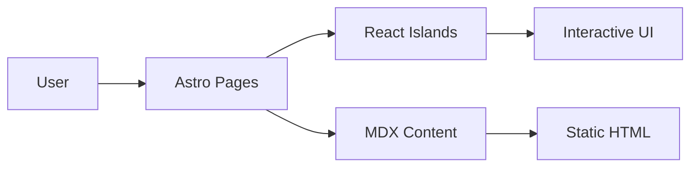

# Advanced README Patterns Reference

## Dynamic Badges with Shields.io

### Build & CI
```markdown


```

### Version & Release
```markdown


```

### Quality & Activity
```markdown


```

### Tech Stack Badges
```markdown


```

### Custom color badges
Format: `https://img.shields.io/badge/{LABEL}-{MESSAGE}-{COLOR}?logo={LOGO}&logoColor={LOGO_COLOR}`

Colors: brightgreen, green, yellow, orange, red, blue, lightgrey, blueviolet, ff69b4 (pink), or hex without #.

## Collapsible Sections

For long content that shouldn't clutter the main view:

```markdown
<details>
<summary>📁 Full Project Structure</summary>

\`\`\`
src/
├── components/
│   ├── ui/
│   │   ├── Button.tsx
│   │   ├── Card.tsx
│   │   └── Modal.tsx
│   ├── layout/
│   │   ├── Header.astro
│   │   ├── Footer.astro
│   │   └── Navigation.astro
│   └── sections/
│       ├── Hero.astro
│       ├── Projects.astro
│       └── Contact.astro
├── content/
│   └── projects/
├── layouts/
│   └── BaseLayout.astro
├── pages/
│   ├── index.astro
│   └── projects/
└── styles/
    └── global.css
\`\`\`

</details>
```

Use collapsible sections for:
- Full project structure (> 15 lines)
- Environment variable tables (> 8 variables)
- API reference (when not the primary audience)
- Changelog excerpts
- Troubleshooting / FAQ

## GitHub-Specific Features

### Alert Blocks (GitHub Flavored Markdown)
```markdown
> [!NOTE]
> This project requires Node.js 18 or higher.

> [!TIP]
> Use `pnpm` for faster installs and better disk usage.

> [!IMPORTANT]
> You must configure your `.env` file before running the project.

> [!WARNING]
> Running `pnpm db:reset` will delete all data in your database.

> [!CAUTION]
> This is an experimental feature and may break between versions.
```

### Linking to Specific Lines
```markdown
See the [auth middleware](src/middleware/auth.ts#L15-L42) for implementation details.
```

### Relative Links
Always use relative links for files in the same repo:
```markdown
See [CONTRIBUTING.md](CONTRIBUTING.md) for guidelines.
Check [docs/API.md](docs/API.md) for the full API reference.
```

## Screenshot & Demo Patterns

### Static Screenshot
```markdown

```

### GIF Demo
```markdown

```

### Video (GitHub supports mp4)
```markdown
https://user-images.githubusercontent.com/USER_ID/VIDEO_ID.mp4
```

### Light/Dark Mode Screenshots
```markdown
<picture>
  <source media="(prefers-color-scheme: dark)" srcset="docs/screenshot-dark.png">
  <source media="(prefers-color-scheme: light)" srcset="docs/screenshot-light.png">
  
</picture>
```

## ASCII Art & Diagrams

### Architecture Diagram
```markdown
\`\`\`
┌─────────────┐     ┌──────────────┐     ┌─────────────┐
│   Browser    │────▶│  Astro SSG   │────▶│   GitHub    │
│   (Client)   │     │  + React 19  │     │   Pages     │
└─────────────┘     └──────┬───────┘     └─────────────┘
                           │
                    ┌──────▼───────┐
                    │   Content    │
                    │ Collections  │
                    │   (MDX)      │
                    └──────────────┘
\`\`\`
```

### Mermaid Diagrams (GitHub renders them natively)
````markdown

````

## Contributing Section Template

```markdown
## Contributing

Contributions are welcome! Please follow these steps:

1. Fork the repository
2. Create your feature branch (`git checkout -b feature/amazing-feature`)
3. Commit your changes (`git commit -m 'feat: add amazing feature'`)
4. Push to the branch (`git push origin feature/amazing-feature`)
5. Open a Pull Request

Please make sure to:
- Follow the existing code style
- Add tests for new features
- Update documentation as needed
```

## Roadmap Pattern

```markdown
## Roadmap

- [x] Dark/Light mode
- [x] Bilingual support (EN/FR)
- [x] Project showcase with filtering
- [ ] Blog section with RSS feed
- [ ] Search functionality
- [ ] Performance monitoring dashboard

See [open issues](https://github.com/USER/REPO/issues) for a full list.
```

## Anchor Link Rules for GitHub

GitHub auto-generates anchors from headings:
- Lowercase everything
- Replace spaces with hyphens
- Remove special characters except hyphens
- Duplicate headings get `-1`, `-2` suffix

Examples:
| Heading | Anchor |
|---------|--------|
| `## Getting Started` | `#getting-started` |
| `## Tech Stack` | `#tech-stack` |
| `## API Reference (v2)` | `#api-reference-v2` |
| `## 🚀 Features` | `#-features` |
| `## C++ Support` | `#c-support` |

Avoid emojis in headings if you plan to link to them — the anchor becomes unpredictable.
